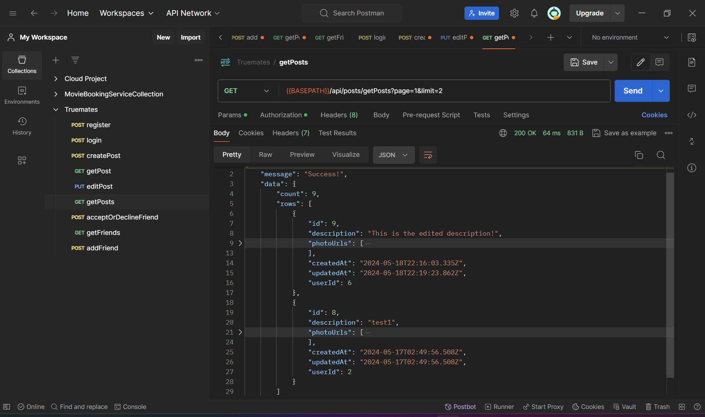
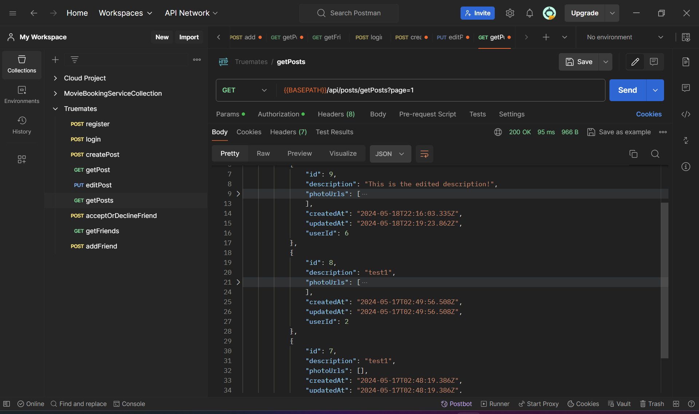
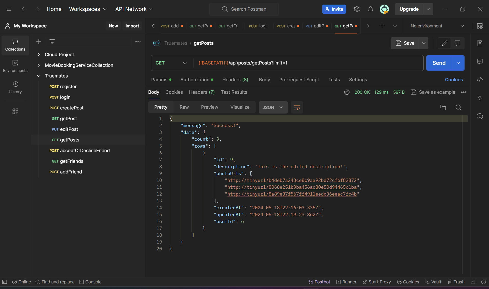
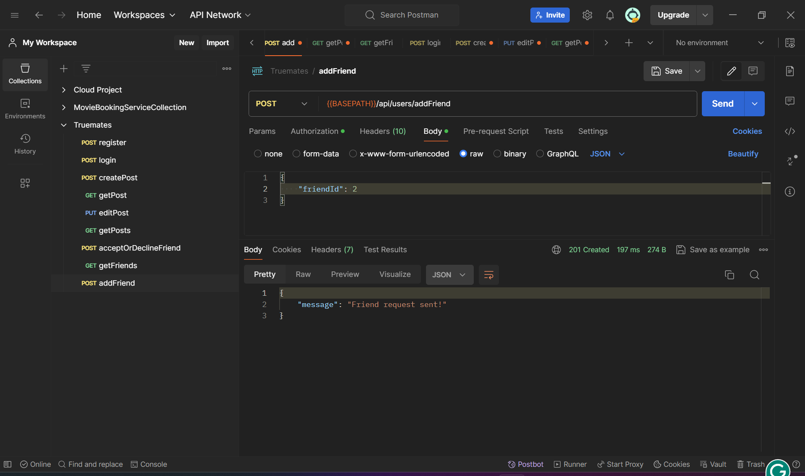
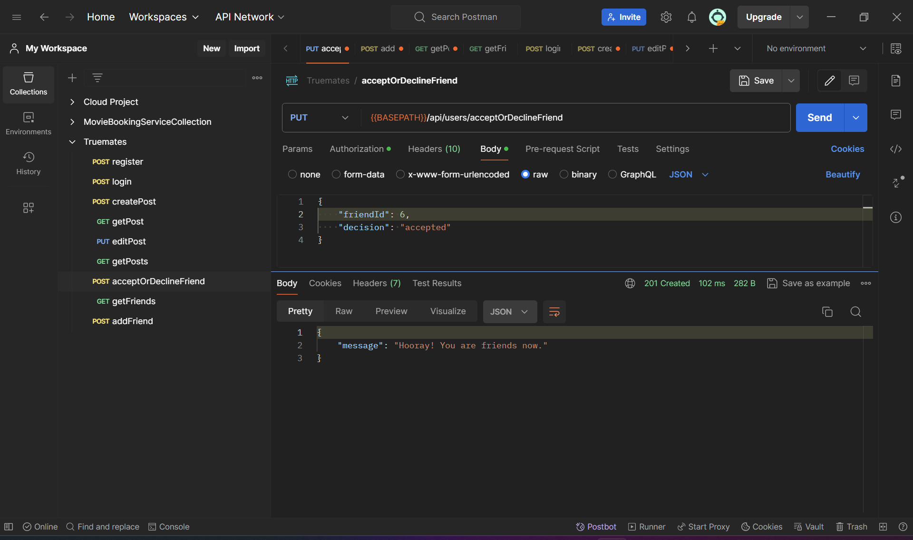
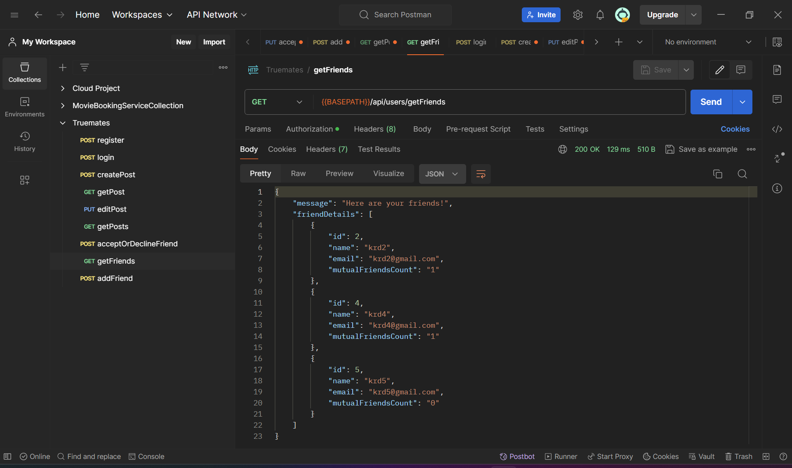

# Requirement 3

## Approach

Pagination for posts includes

-   Page and limit which can be specified by the user. It has some default values (1 and 3 respectively) as well in case there is nothing mentioned.

Let us consider 2 users 'A' and 'B' to understand my approach to add friends

-   To implement a friend system I added two tables to the database.
    1. FriendRequests (senderId, receiverId, status) [Referred to in the future as FR]
    2. UsersFriends (userId, friendId) [Referred to in the future as UF]
-   When 'A' sends a friend request to 'B' there is a request created in the table FR

```SQL
INSERT INTO "FriendRequests" ("senderId", "receiverId", "status")
VALUES ("userId of 'A'", "userId of 'B'", "pending");
```

-   When 'B' accepts/declines the friend request, the request in table FR is updated and two new entries are made in table UF.

```SQL
UPDATE "FriendRequests"
SET status="accepted/declined"
WHERE "senderId"="userId of A" AND "receiverId"="userId of B";

INSERT INTO "UsersFriends" ("userId", "friendId")
VALUES ("userId of 'A'", "userId of 'B'"), ("userId of 'B'", "userId of 'A'");
```

Let us consider four users 'A', 'B', 'C' and 'D' to understand my approach to get friends list. We will get the friends list for user 'A'.

-   Step 1: We get all the friends of 'A'

```SQL
SELECT * FROM "UsersFriends"
WHERE "userId"="userId of 'A'";
```

-   Step 2: We fetch the details of each friend of 'A'

```SQL
SELECT ("id", "name", "email") FROM "Users"
WHERE "userId"="userId of friend('B', 'C', 'D')";
```

-   Step 3: Run a query to get the mutual friends count

```SQL
SELECT COUNT(*) as mutualFriendCount
FROM "UsersFriends" as uf1
JOIN "UsersFriends" as uf2 ON uf1."friendId" = uf2."friendId"
WHERE uf1."userId" = :userId AND uf2."userId" = :friendId;

```

## Validations

Let us consider 2 users 'A' and 'B' to explain the validations implemented

-   'A' cannot make a friend request to 'A'(itself).
-   'A' cannot make a friend request to 'B' if there already exists a friend request from 'A' to 'B' or a friend request from 'B' to 'A'.
-   'A' can either accept or decline a friend request sent from 'B'. This can be done only if there exists a friend request from 'B' to 'A' and the status of that request is "pending".

## Features

-   The getPosts endpoint fetches all posts with pagination. The 2 parameters page and limit may or may not be mentioned.
    
    
    
-   User can send friend requests and accept/decline friend requests sent to them.
    
    
-   The getFriends endpoint fetches all a list of all friends with their name, email and the number of mutual friends they have with the user.
    
