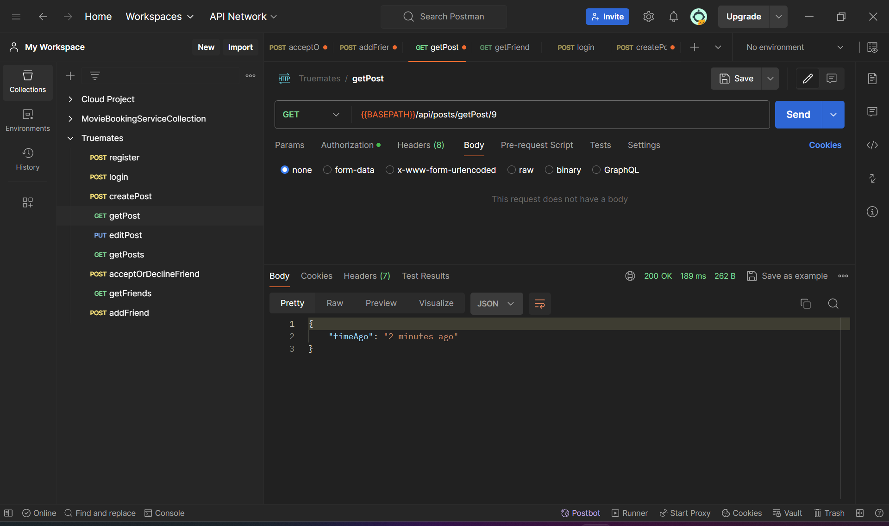
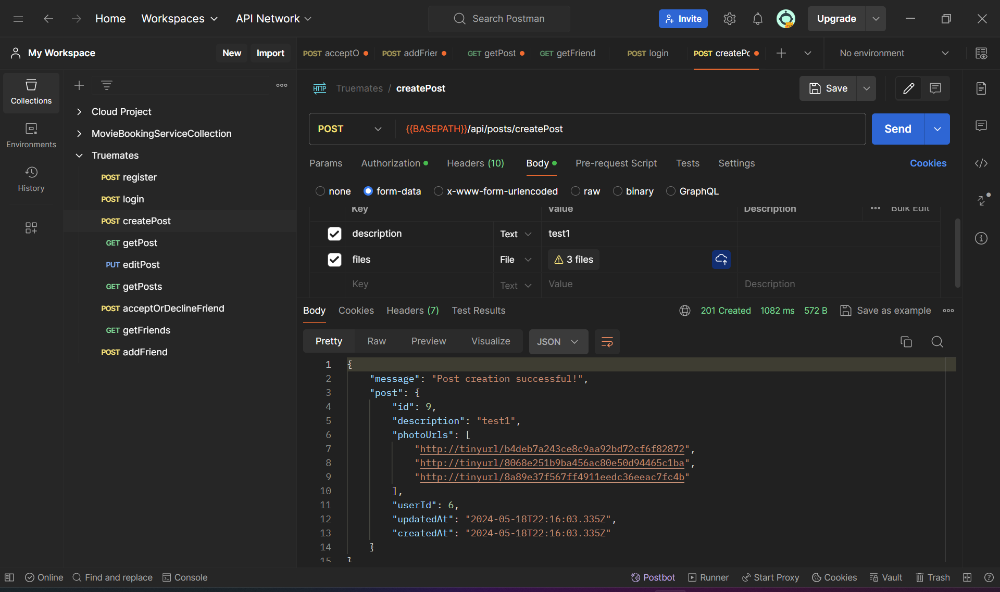
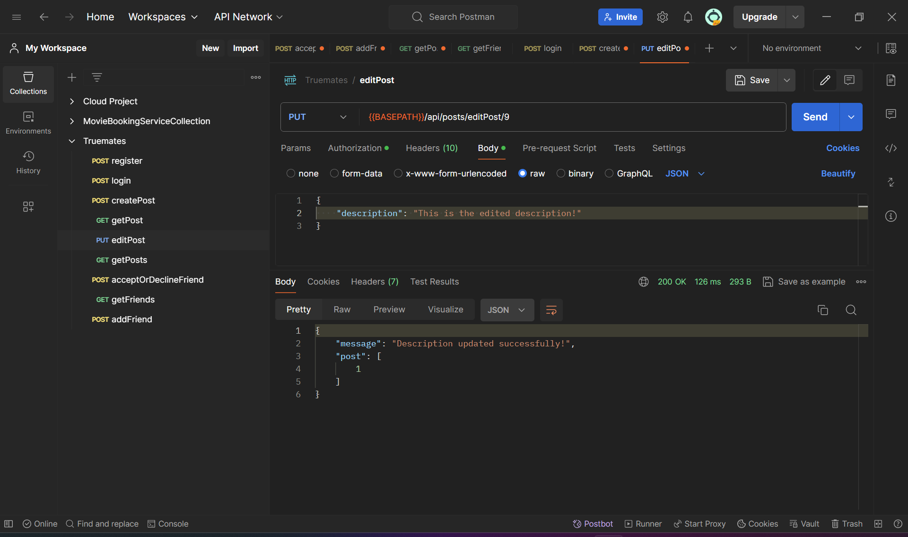

# Requirement 2

## Step 1: Initialize the project

-   Open the terminal, navigate to the project directory and initialize a new node.js project

```bash
mkdir true-mates-backend
cd true-mates-backend
npm init -y  # Initializes a new Node.js project with default settings
```

-   Install the required dependencies

```bash
npm install express sequelize pg pg-hstore jsonwebtoken multer dotenv nodemon
npm --save-dev sequelize-cli
```

-   Initialize a new git repository

```bash
git init
```

-   Add a .gitignore file from https://github.com/github/gitignore/blob/main/Node.gitignore to your project folder before committing anything.

-   Store your GCS secret key JSON file in the root directory of the project folder
-   Add the secret key file name to the gitignore file.

-   Create a .sequelizerc file and initialize a sequelize project
-   Create a .env file to store environment variables
-   Add scripts to package.json to run sequelize commands to create, migrate, seed, reset and reseed the database

## Approach

-   Sequelize by default adds createdAt and updatedAt fields when creating new models which I utilized to complete the first bit.
-   The moment module calculates the time difference between now and the createdAt attribute of the requested post.
-   I changed the posts table schema by dropping the photoUrl column and creating a new column named photoUrls which stores an array of strings instead of a single string using sequelize migrations.
-   A post's description can be edited through a put request.

## Validations

-   The number of images uploaded cannot be more than 5.
-   Created an md5 hash using javascript's crypto library for each uploaded file using the filename, creation dateTime and the userId of the creator for unique keys for each image being stored in GCS.
-   Post description can only be edited by a user if that user is its creator.

## Features

-   The getPost request returns the time difference between current time and creation time of the post
    
-   The photoUrl attribute of type STRING was replaced by photoUrls attribute of type ARRAY of STRINGS, which stores an array of urls (GCS storage keys for each image).
    
-   The description of a post can be edited with a put request.
    
