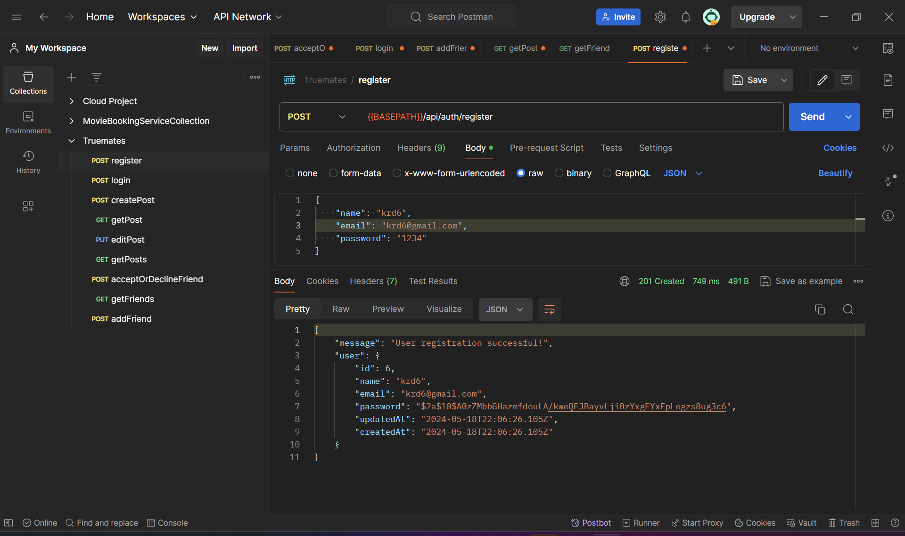
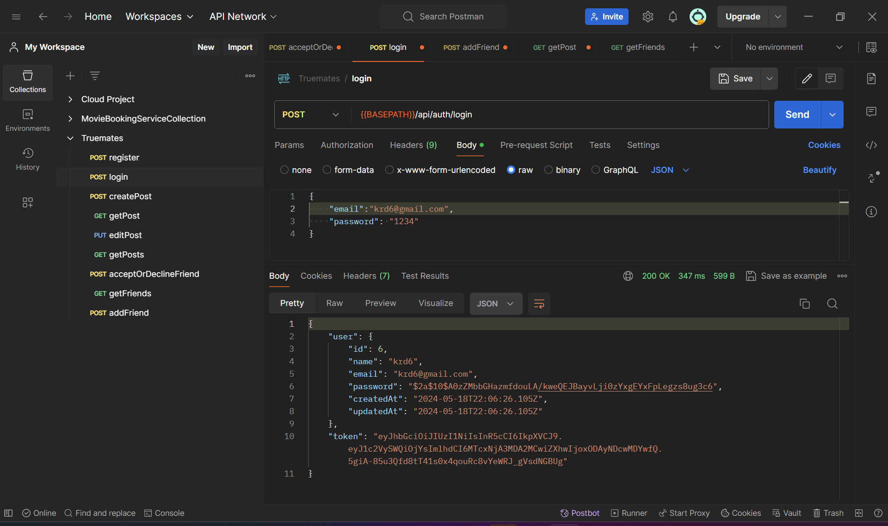
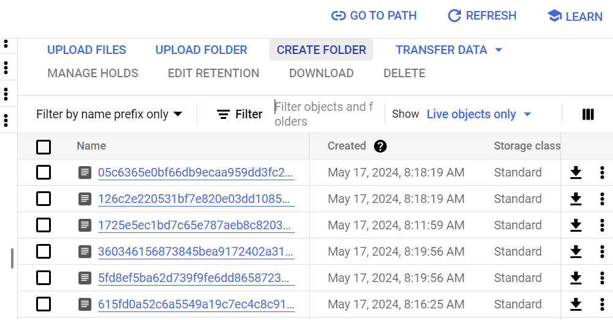

# Requirement 1

## Approach

-   User gives name, email and password while registering through a post request. If the email is not already in the database, the app creates a new user with a hashed password stored to the database in place of the plaintext password.
-   User gives email and password while logging in through a post request. If the email does not exist in the user or the password entered is incorrect then corresponding messages are sent back. If the validation is successful then the request returns a JWT bearer token.
-   The createPost request allows a logged in user to create a post with two attributes, namely, description and photoUrl.
-   The photoUrl stored is the key for the image blob that has been uploaded to GCS.

## Validations

-   The app prevents duplicate user registration using a middleware function to check the Users table before calling the register funtion.
-   A middleware is in place to check that a bearer token is present, is valid and has not expired before allowing any activity besides registration and login.
-   Post is created only after storing the uploaded image to GCS. If the upload fails for some reason then post creation fails and returns a message with the reason.
-   Posts database only stores the GCS bucket key for each image for future access.

## Features

-   Registration
    
-   Log in
    
-   CreatePost with 2 attributes. (Unfortunately I forgot to take a ss before updating the table schema)
-   Upload images to GCS when creating post
    
